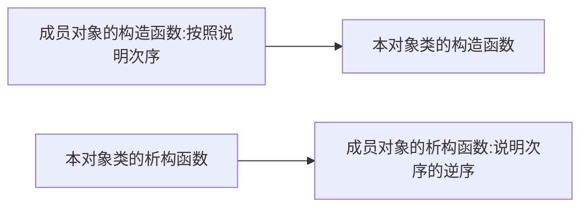
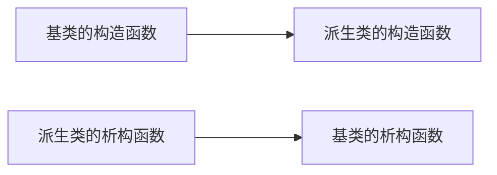
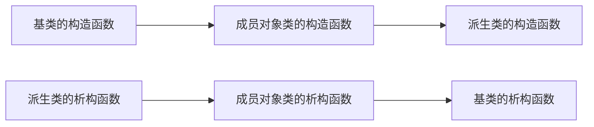
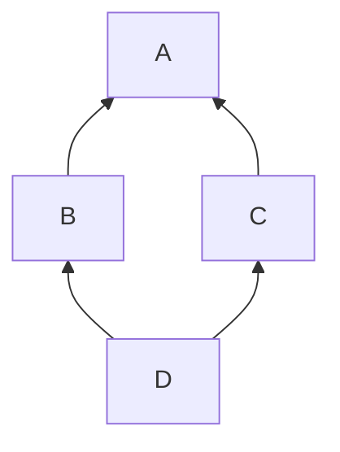

# 高级程序设计复习

## 考试范围(重点)

1. 类和对象
   1. 对象和类
   2. **对象的访问控制**
   3. **对象的初始化和消亡**
   4. **常量对象/静态对象/友元**
2. 继承-派生类
   1. 单继承
   2. 消息的多态和动态绑定
   3. 抽象类/多继承
3. 异常处理 [练手]
   1. **异常的异地处理, 结构化异常处理**
4. **IO** [练手]
   1. 面向控制台的IO
   2. 面向文件的IO
5. **操作符重载**  [练手] 
   1. 单目操作符重载
   2. 双目操作符重载
   3. 特殊操作符重载
6. 泛型 / STL [练手]
   1. 函数模板
   2. 类模板
   3. STL的容器类模板, 算法模板, 迭代器
7. 消息(事件)驱动的程序设计
8. 函数式/逻辑式编程
   1. 程序设计范式简介
   2. 函数式程序设计
   3. 逻辑式程序设计

## PPT review

### W1

#### 数据抽象与封装概述

- **抽象**是指该程序实体的外部可观察到的行为, 不考虑该程序实体的内部是如何实现的

  > "黑盒子" 概念上的简化, 不仅限于程序设计, 在计算机的许多层面都存在抽象.

- **封装**是把该程序实体内部的具体实现细节对使用者隐藏起来, 只对外提供一个接口.

  > 封装是一种手段, 用于信息保护, 是实现抽象的手段

- **过程抽象**: 用一个名字来代表一段完成一定功能的程序代码, 代码的使用者只需要知道代码的名字以及相应的功能, 而不需要知道对应的程序代码是如何实现的

- **过程封装**: 把命名代码的具体实现隐藏起来(对使用者不可见, 或不可直接访问), 使用者只能通过代码名字来使用相应的代码

- **数据抽象**: 只描述对数据能实施哪些操作以及这些操作之间的关系, 数据的使用者不需要知道数据的具体表示形式

- **数据封装**: 把数据及其操作作为一个整体来进行实现, 其中, 数据的具体表示被隐藏起来, 对数据的访问只能通过封装体对外提供的接口操作来完成.

> 与过程抽象与封装相比, 数据抽象与封装能够实现更好的数据保护.

#### 面向对象程序设计概述

- **对象**是有数据及能对其实施的操作所构成的封装体.
- **类**描述了对象的特征, 实现抽象

> 对象属于*值*的范畴, 是程序运行时刻的实体;
>
> 类则属于*类型*的范畴, 属于编译时刻的实体;

- **继承**: 在定义一个新的类时, 可以把已有类的一些特征描述先包含进来, 然后再定义新的特征

- **多态(Polymorphism)**: 某一论域中的一个元素存在多种形式和解释. 在程序中, 多态通常体现为

  - 一名多用:
    - 函数名重载
    - 操作符重载
  - 类属(泛型):
    - 类属函数: 一个函数能对多种类型的数据进行操作
    - 类属类: 一个类可以描述多种类型的对象

  - 面向对象程序特有的多态:
    - 对象类型的多态: 子类对象既属于子类, 也属于父类
    - 对象标识的多态: 父类的引用或指针可以指向或引用父类对象, 也可以指向或引用子类对象
    - 消息的多态: 发给父类对象的消息也可以发给子类, 父类与子类可以给出不同的解释

- **绑定(Binding)**: 确定对多态元素的某个使用是多态元素的哪一种形式. 可分为:
  - 静态绑定(Static Binding): 在编译时刻确定
  - 动态绑定(Dynamic Binding): 在运行时刻确定

##### 过程式程序设计与对象式程序设计的特点

> 可能作为简答题

- 过程式程序设计:
  - 以功能为中心, 强调过程抽象, 但数据与操作分离, 二者联系松散
  - 实现了操作的封装, 但数据是公开的, 数据缺乏保护
  - 按子程序划分模块, 模块边界模糊
  - 子程序往往针对某个程序而设计, 这使得程序难以复用
  - 功能易变, 程序维护困难
  - 基于子程序的解题方式与问题空间缺乏对应

- 面向对象程序设计:
  - 以数据为中心, 强调数据抽象, 操作依附于数据, 二者联系紧密
  - 实现了数据的封装, 加强了数据的保护
  - 按对象类划分模块, 模块边界清晰
  - 对象类往往具有通用性, 再加上继承机制, 使得程序容易复用
  - 对象类相对稳定, 有利于程序维护
  - 基于对象交互的解题方式与问题空间有很好的对应

### W2

#### 对象与类

- 类属于**类型范畴**的程序实体, 它一般存在于静态的程序(编译程序中看到的)
- 而动态的运行中的面向对象程序则是由对象构成的
- 对象在程序运行时创建

##### 类成员的访问控制

- `public`: 访问不受限制, 具有public访问控制的成员构成了类与外界的一种接口(interface).
- `protected`: 只能在本类/派生类/友元的代码中访问
- `private`: 只能在本类/友元的代码中访问

#### this 指针

#### 构造函数与析构函数

- **默认构造函数**: 不带参数的(或所有参数都有默认值的)构造函数被称为默认构造函数.
- 注意: 析构函数可以显式调用, 这时并不是让对象消亡, 而是暂时归还对象额外申请的资源.

##### 成员对象初始化和消亡处理的次序



> 注意: 构造和析构是完全相反的顺序, 因此析构的时候, 是按照成员对象说明顺序的**逆序**来析构的!

### W3

#### 拷贝构造函数

- 注意, 在涉及指针的情况下, 需要考虑是否重写拷贝构造函数.

- 注意, 自定义的拷贝构造函数默认调用的是成员对象类的**默认构造函数**来对成员对象初始化!!! 如果想让两个类的成员类完全相同, 需要在拷贝构造函数的成员初始化表中的显式指出.

  ```c++
  class A {
      //...
  }
  class B {
      B(const B& b): a(b.a)
      {
          //...
      }
  }
  ```

#### 常成员函数及静态成员

- **常成员函数**

  - 在常成员函数中不能 **修改** *任何* 数据成员的值.

  - 常量对象只能调用对象类中的常成员函数.

    ```c++
    class Date{
    public:
      int get_day() const {
        //...
      }
      void set() {
        //...
      }
      void func(const Date &d) {
        d.get_day() // OK
        d.set() // Error
      }
    };
    ```

- **静态数据成员**: 

  - 类的静态数据成员对该类的所有对象只有一个拷贝.

  - 注意: 静态数据成员(常成员除外)的初始化**必须**是在函数体外部的声明

    ```c++
    class A {
      static int shared;  
    };
    int A::shared = 0; // 必须这么写
    ```

- **静态成员函数**

  - 静态成员函数只能**访问**类的静态成员
  - 静态成员函数没有隐藏的this参数

#### 友元

- 可以指定某些与一个类密切相关的, 又不适合作为该类成员的程序实体直接访问该类的非public成员, 这些程序实体称为该类的友元. 友元是数据保护和数据访问效率之间的一种折衷方案.
- 注意: 友元还是很重要的, A通过声明友元B, 该友元类B可以视类A中的成员为public, 这比直接将A中的数据成员变为public好.
- 友元具有不对称性, 不具有传递性.

#### 类作为模块

- 划分模块的基本准则
  - 内聚性最大
  - 耦合度最小
  - 便于程序的设计, 理解和维护, 能够保证程序的正确性
- Demeter法则:
  - 除了能访问自身类结构的直接子结构(本类的数据成员)外, 不能以任何方式依赖于任何其他类的结构
  - 只因向某个有限集合的对象发送消息

### W4

#### 继承

- 如果派生类中没有显式说明, 则基类的友元不是派生类的友元
- 如果基类是另一个类的友元, 而该类没有显式说明, 则派生类也不是该类的友元

**protected**: 把有可能被派生类使用的&不宜对实例用户公开的成员声明为protected.

- 如果派生类中定义了与基类同名的成员, 则基类的成员在派生类的作用域内不直接可见, 访问基类的同名成员需要用基类名受限(`<BaseClass>::<name>`)

- 注意: 即使派生类中定义了**与基类同名但参数不同**的成员函数, 基类的同名函数在派生类的作用域中也是不直接可见的, 也需要用基类名受限的方式来使用.(注意, 这不属于函数名重载: 两个函数虽然函数名相同, 参数不同, 但是具有不同的函数作用域)

  可以在派生类中使用using声明把基类的某个函数名对派生类开放.

  ```c++
  class Base {
  protected:
    int val = 0;
    void showVal(int t) {
      printf("val: %d\n", this->val);
    }
    void showVal() {
      printf("base val: %d\n", this->val);
    }
  };
  
  class SubClass : public Base
  {
    int val = -1;
  public:
    using Base::showVal; // 注意, 没有"()"
    void showVal() {
      printf("subClass val: %d\n", this->val);
    }
    void func() {
      val = 1;
      printf("baseVal: %d subVal: %d\n", Base::val, this->val);
      showVal(1); // 如果没有using ... 就需要写成 Base::showVal(1);
      showVal(); // 即使写了using 也会调用派生类的结果 
    }
  };
  ```

##### 继承方式

| 继承方式\基类成员 | public    | private      | protected |
| ----------------- | --------- | ------------ | --------- |
| public            | public    | 不可直接访问 | protected |
| private           | private   | 不可直接访问 | private   |
| protected         | protected | 不可直接访问 | protected |

> **注意**: 非常重要, 必考!
>
> - public: 外部实例可访问, 其派生类可访问
> - protected: 外部实例不可访问, 其派生类可访问
> - private: 外部不可访问, 其派生类不可访问
> - 不可直接访问: 相当于被隐藏了, 当前这个派生类已经无法访问, 更不用说其派生类或者外部实例了
>
> 个人认为不同的继承方式决定了继承来的基类成员的可见性
>
> - public继承, 不改变原先的成员可见性, 相当于子类型
> - protected继承, 将public, protected都改为protected
> - private继承同上

- 继承方式的调整* : 可以通过在派生类中显式指出基类成员函数的可见性来调整.

  ```c++
  class A{
  public:
      void f1();
  };
  class B : private A {
  public: 
      A::f1; // 调整
  };
  ```

##### 子类型

- c++中, 将public方式继承的派生类看做是基类的子类型.
  - 对基类对象能实施的操作也能作用域派生类对象
  - 在需要基类对象的地方可以用派生类对象去替代

##### 派生类对象的初始化和消亡处理



> 注意: 这里与**类的组合**中的顺序完全相反!

##### 包含继承&组合关系的类的初始化和消亡处理



##### 派生类的赋值操作

- 注意: 派生类自定义的赋值操作不会自动调用基类的赋值操作, 需要在自定义的赋值操作符重载中显式指出

## 可能会出找bug题的知识点

- 在类中说明一个数据成员的类型时, 如果未见到相应类型的定义, 或相应类型未定义完, 则该数据成员的类型只能是这些类型的**指针或引用**.

  ```c++
  class A; //只是声明, 不是定义
  class B{
      A a; //Error
      B b; //Error
   A *p;
      B *q;
      A &aa;
      B &bb;
  };
  ```

  > 这里需要强调**声明**与**定义**的区别: [cpp——类——声明 定义 实现_mardax的博客-CSDN博客_cpp 定义类](https://blog.csdn.net/mardax/article/details/54948173)

- 对象的创建

  ```c++
  class A;
  //...
  int main() {
      A a(); //Error!
      A a; // 默认构造
      A a = A(); //默认构造
      A b[5] = {A(), A(1), A("abcd"), 2, "xyz"}; // 比较罕见, 可以这么写
      A *p = new A;
      A 
      A *p = new A(2);
      A *p = new A[20]; // 只能调用个对象的默认构造函数
  }
  ```

- 对于常量和引用数据成员, 不能在说明它们时初始化, 也不能采用赋值操作在构造函数中对它们初始化. 需要在**成员初始化表**中初始化.

  ```c++
  class A {
    int x = 1; // OK 
    const int y = 2; // Error
    int &z = x; // Error
  public: 
    A(): z(x), y(1) // 必须这么写 
    {
        x = 0; // OK
        y = 1; // Error
        z = &x; // Error
    }
  };
  ```

- 拷贝构造-指针

  ```c++
  class String {
      char *str;
      int len;
  public: 
      //需要重写拷贝构造
      String(const String &s) {
       this->len = s.len;
          this->str = new char[len+1];
          strcpy(str, s.str);
      }
  };
  ```

- 定义派生类时一定要见到基类的定义

  ```c++
  class A;
  class B : public A // Error
  {
      //... 
  };
  ```

- 自定义赋值操作(=操作符重载)

  > 注意: 赋值操作 & 拷贝操作 都需要先判断是否发生**自身赋值**!!!

  ```c++
  class B: public A {
  public: 
    B& operator = (const B& b) {
      if(this == &b) return *this; // 防止自身赋值!!!
      printVal(); // val: 0
      *(A*)this = b; // 通过强制转换为基类指针后赋值, 完成基类的赋值
      printVal(); // val: -1
      return *this;
    }
  };
  ```

### W5

#### 虚函数与消息的动态绑定

- **消息的多态性**: 相同的一条消息可以发送到不同类的对象, 从而会得到不同的处理

- **静态绑定**: 在编译时刻根据对象的类型来决定采用哪一个消息处理函数

- **动态绑定**: 动态绑定是指在程序运行过程中，根据具体的实例对象才能具体确定是调用了哪个方法。也就是说，动态绑定只能用到运行期的可用信息。

- **函数的覆盖(重定义)[override]**: 对于基类中的一个**虚函数**, 在派生类中定义的, 与之相同型构的成员函数是对基类该成员函数的重定义

- 注意

  - 静态成员函数不能是虚函数

  - 构造函数不能是虚函数, 析构函数往往是虚函数

    > 注意: 如果析构函数不进行动态绑定的话, 在一些特定情况下, 析构函数会只执行基类, 而不执行本身的
    >
    > ```c++
    > class A {
    >     // ...
    >     ~A() {
    >         // ...
    >     }
    > };
    > class B: public A
    > {
    >     ~B(){
    >         // ...
    >     }
    > };
    > 
    > int main() {
    >     A *p = new B();
    >     delete p; // 只执行~A(), 因为没有写 virtual ~A();
    > }
    > ```

  - 只要在基类中说明了虚函数, 在派生类, 派生类的派生类, ... 中, 同型构的成员函数都是虚函数, (除基类外, virtual 可不写, 但建议写)

  - 只有通过指针或引用访问对象类的虚函数时才进行动态绑定, 例如`((A)b1).setVal(-1);` 不进行动态绑定

  - **基类的构造函数和析构函数对虚函数的调用不进行动态绑定**(原因较复杂)

  

##### 通过基类指针访问派生类中新定义成员

```c++
class A;
class B: public A;

int main() {
    A *p = ...;
  	B *q = dynamic_cast<B*>(p);
    if(q != nullptr) // 细节决定成败! 不能少, 万一p指向的不是B类型的对象? 
    {
        
    }
}
```

何时需要定义虚函数?

- (笔者认为)就像学生继承老师, 在同一个技能上, 学生可以精进出不同于老师的发挥, 这时候就需要虚函数, 否则只能给学生的技能另起一个名字, 也不能要求老师和学生同台表演同一个技能了.

- 在基类中根本无法给出某些成员函数的实现, 它们必须由不同的派生类根据实际情况给出具体实现(纯虚函数)

  ```c++
  virtual void pure_virtual_func() = 0;
  ```

#### 抽象😋类

- 包含纯虚函数的类称为抽象类
- 抽象类不能创建对象(没有完全实现), 其作用是为派生类提供一个基本框架和一个公共的对外接口.

##### 抽象数据类型(abstract data type, ADT) 

只考虑类型的抽象性质, 而不考虑该类型的实现

### W6

#### 多继承

##### 多继承的初始化和析构的调用顺序

```c++
class C: public A, public B 
{
    //...
};
//构造函数调用顺序: A->B->C
```

- 多继承带来的问题: 使得语言复杂化, 加大了编译程序的难度以及使得消息绑定复杂化等, 从而更正确使用多继承带来困难. 因此, 有些面向对象语言(Smalltalk, Java)放弃了多继承机制

- 多继承的两个主要问题:

  - 名冲突问题---> 基类名受限
  - 重复继承问题---> 虚基类
  

##### 虚基类



- 虚基类的构造函数由最新派生出的类的构造函数直接调用
- 虚基类的构造函数优先非虚基类的构造函数

#### 聚合与组合

- `is-a-kind-of`继承, `is-a-part-of`组合/聚类

- **聚合(aggregation)**: 采用**对象指针**表示, 被包含的成员对象在外部创建, 然后添加进来, 可以独立于包含其的类而存在, "公司&员工"
- **组合(composition)**: 被包含的对象在包含其的对象内部创建, 并伴随外部类的消亡而消亡. "人&手"
- 注意, 具有聚合/组合关系的两个类不具有子类型关系.


### W7

#### 基本操作符重载

- C++允许对**已有的操作符**进行重载, 使得它们能对自定义类型的对象进行操作

- 与函数名重载一样, 操作符重载也是实现**多态性**的一种语言机制

- 实现方式
  - 作为一个类的非静态的成员函数(操作符`new`/`delete`除外)
  - 作为一个全局的友元函数
  
- 基本原则
  - 不能改变操作数的个数
  - 不能改变元操作符的优先级和结合性
  - 尽量遵循已有操作符原来的语义
  
- 注意, 对于不同类型的两个操作数的运算, 只能通过友元的方式实现, 并且需要实现多个(不同的结合次序)

  > ```c++
  > //例: 自定义类 + int 
  > friend T operator + (T a, int b);
  > friend T operator + (int a, T b);
  > friend T operator + (T a, T b);
  > ```

### W8

#### $\lambda$表达式

- 常用格式

  > `[环境变量使用说明]` `(形式参数表)` `->返回值类型`(可省略) `{函数体}`
  >
  > 例: `[](double x)->double{return x * x;}`
  
  - 环境变量使用说明:	
  
    - `null` 不能使用外层作用域中的自动变量
    - `&` 按引用方式使用外层作用域的自动变量
    - `=` 按值方式使用外层作用域的自动变量
  
    > 注意, 所谓外层变量只能是一层, 不是所有外层.
    >
    > ```c++
    > void f2()
    > {
    >   int c = 0;
    >   [=]() {
    >     int A = a + 1; // error, cannot reach
    >     int B = b + 1; // error
    >     int C = c + 1; 
    >     printf("lambda\n");
    >   }
    > }
    > 
    > void f1()
    > {
    >   int b = 0;
    >   f2();
    > }
    > 
    > int main()
    > {
    >   int a = 0;
    >   f1();
    > }
    > ```
  
- $\lambda$表达式的用途:

  - 直接使用

  - 作为参数~函数指针

    > ```c++
    > void f(int (*fp)(int), int x) {
    >   int res = fp(x);
    >   printf("%d\n", res);
    > }
    > 
    > int main() {
    >   f([](int x){return x*x;}, 10);
    >   return 0;
    > }
    > ```


#### 特殊操作符重载

##### =重载

- 注意,  一般重载赋值操作符(=)的同时, 也需要重载拷贝构造函数!

  > 区分下面两个"=":
  >
  > ```c++
  > A a;
  > A b = a; // 等价于A b(a); 调用拷贝构造函数
  > ---
  > b = a; // 赋值, 调用赋值操作符
  > ```

##### new/delete重载

```c++
void * operator new (size_t size) {
    void *p = malloc(size);
    memset(p, 0, size);
    return p;
}
```

- 返回类型必须为`void *`

一般来说, 如果对某个类重载了new, 则相应的也要重载delete.

```c++
void operator delete (void *p, (size_t size)) {
    free(p);
    
}
```

> 第二个参数 `size_t size`可选.

##### 重载函数调用操作符()

在c++中, $\lambda$表达式是通过函数对象来实现的.(隐式创建一个对应的类和对象)

##### 自定义类型转换操作符

- 其他类型->该类型

  ```c++
  Complex(double r) {this->real = r, this->imag = 0;}
  ```

- 该类型->其他类型

  ```c++
  operator int() {return this->real + this->imag;}
  ```

> 注意, 最好显式表明类型转换, 否则会发生歧义!

### W9

#### 输入输出

##### <<的重载

```c++
friend ostream& operator << (ostream& out, const A &a) {
    out << a.x << ',' << a.y;
    return out;
}

int main() {
    cout << a1 << endl << a2 << endl;
}
```

- 注意, 打开文件需要判断文件是否打开成功`if(file.is_open())`
- 注意, 打开文件, 最后要记得关闭文件

### W10

#### 异常处理

- `try`语句块的作用是启动异常处理机制
- `throw`预计用于发现异常情况时抛掷异常对象
- `catch`语句块用于捕获throw抛掷的异常对象并处理相应的异常, 需要紧接在某个`try`语句的后面

##### 异常处理的嵌套

- 当在内层的try语句的执行中发生了异常, 则首先在内层的try语句块之后的catch语句序列汇总寻找与之匹配的处理, 如果内层不存在能捕获相应异常的catch, 则逐步向外层进行查找. 如果最终没有找到, 则调用系统的terminate函数abort.

### W11

#### 事件驱动的程序设计

- Windows 应用采用的是一种基于事件(消息)驱动的**交互式流程控制** 结构
- 每个应用程序都有一个消息队列
  - **取消息-处理消息**的过程称为消息循环
- 每个窗口都有一个消息处理函数
- MFC的类型设计
  

#### 基于文档-视的应用框架

- **应用框架(Application Framework)**是一种通用的, 可复用的应用程序结构, 该结构规定了程序应包含哪些组件以及这些组价的关系, 它封装了程序处理流程的控制逻辑
- **文档**: 用于存储和管理程序中的数据
- **视**: 显示文档数据以及实现文档数据进行操作时与用户的交互功能
- 文档-视结构实现了
  - 数据的内部表示形式和数据的外部展现形式相互独立
  - 一个文档对象可以对应一个或多个视对象, 即, 对于同一个文档数据可以用不同的方式进行显式和操作

#### 图形用户接口*

### W12

#### 泛型

- 一个程序实体能对多种类型的数据进行操作或描述的特性称为类属(或泛型)(generics)

- 基于具有类属性的程序实体进行程序设计的技术称为**泛型程序设计**

##### 函数模板

- 注意, 在涉及自定义类型的时候, 一定要考虑该操作是否定义, 是否需要重载操作符/拷贝构造函数
- **函数模板的实例化**: 通常是隐式的, 由编译程序根据函数调用的实参类型自动把函数模板实例化为具体的函数, 这个过程叫做**模板实参推导**.

##### 带非类型参数的函数模板

```c++
template <class T, int size>
void f(T a) {
    T temp[size];
    // ...
}

f<int, 10>(1);
```

这样的函数模板在使用时需要显式实例化.(例如上例)

- **类属类**: 用到的类型可变, 但操作不变, 称为类属类, c++中用**类模板**实现.
- 类模板的实例化需要程序在程序汇总显式地指出

##### 模板的复用

模板也属于一种多态, 称为参数化多态. 模板属于源代码复用

注意, 实现类模板时需要把模板的定义和实现都写在一个头文件里, 避免链接时出错.

##### 类模板的友元函数*

- `friend void f<T>(A<T>& a);`一种T对应一对类与友元
- `template <class T1>friend void f(A<T1>& a);` f的实例与A的实例是多对多友元

### W13

#### 基于STL的编程

注意, 如果容器中的元素类型是一个类, 则针对该类可能需要:

- 自定义拷贝构造函数和赋值操作符重载函数
- 重载小于操作

#### W14

#### 命令式程序设计

- 需要对"如何做"进行详细描述, 包括操作步骤和状态变化
- 命令式程序设计范式的典型代表: 
  - 过程式程序设计
  - 面向对象程序设计

#### 声明式程序设计

- 只需要对"做什么"进行描述, 不需要给出操作步骤和状态变化
- 有良好的数学理论支持, 易于保证程序的正确性, 并且, 设计出的程序比较精炼和具有潜在的并行性.
- 声明式程序设计范式的典型代表:
  - 函数式程序设计
  - 逻辑式程序设计
- **函数式程序设计**: 把程序组织成一组数学函数, 计算过程体现为一些列的函数应用, 基于的理论是递归函数理论和lambda验算.
  - 基本特征: 
    - 纯函数, 相同的参数调用会得到相同的值, 只会产生计算结果
    - 没有状态: 计算体现为数据之间的映射
    - 函数也是值, 可由已有函数生成新的函数
    - 递归是主要的控制结构, 重复操作采用递归实现, 而不采用迭代
    - 延迟求值: 需要用到表达式的值的时候才会去计算它
    - 潜在的并行性: 由于上述特点, 一些操作可以并行执行
  - 纯函数式语言: Haskell, ...
  - 支持函数编程的语言: Java 8, Python, C++11(主要通过STL实现)

##### 函数式程序设计的基本手段

- 递归和尾递归(递归调用时函数的最后一步操作, 效率较高)
- 过滤/映射/规约操作
- 部分函数应用: 通过固定某函数的一些参数的值, 生成一个新函数, 该新函数不包含原函数中已指定固定值的参数
- 科里化: 把一个多参数的函数变换成一系列单参数的函数, 得到一个按照参数顺序的函数链

##### 逻辑式程序设计

- 程序由一组事实和一组推理规则构成, 在事实基础上运用推理规则来实施计算
- 基于的理论是谓词演算
- 特征:
  - 数据就是程序
  - 计算有实现系统自动完成
- 语言: Prolog, Datalog

#### 并行程序设计*

- 并发与并行
  - 并发: 同一时间段内可以交替处理多个操作
  - 并行: 同一时刻同时处理多个操作
- 进程与线程
  - 进程(process): 是指一个在内存中运行的应用程序. 每一个进程都有自己独立的一块内存空间, 一个进程可以有多个线程
  - 线程(thread): 进程中的一个执行任务, 同类的多个线程共享进程的堆和方法区资源, 但每个线程有自己的程序计数器和本地方法栈
- 数据竞争: 当多个进程或线程同时访问共享数据时, 至少有一个任务会修改数据的场景
- 死锁: 两个或以上的运算单元, 每一方都在等待其他方释放资源, 但是没有任何一方愿意释放资源

## 一些无关考试的话

- 面向对象是一种程序设计思想, 用任何语言都可以实现, 不过采用面向对象语言会使得面向对象程序设计更加容易, 语言也能提供更多的面向对象保障

  > 或者说, 无非是不同的语言实现面向对象的复杂度存在差异, 部分语言适配的很好, 因此写起来就容易些.

- override OR overwrite ? [terminology - Overwrite or override - Stack Overflow](https://stackoverflow.com/questions/8651562/overwrite-or-override)

  > To "**overwrite**" something is to put something else in its place, destroying the thing overwritten. To "**override**" something is to cause something else to operate instead of it without harming or changing the thing overridden.

- 关键词`override` - when to use ? https://stackoverflow.com/a/39932616/18494159

  > So the general advice is,
  >
  > - Use `virtual` for the base class function declaration.
  >   This is technically necessary.
  > - Use `override` (only) for a derived class' override.
  >   This helps maintenance.

- `void *`是个啥? [C 语言中 void* 详解及应用 | 菜鸟教程 (runoob.com)](https://www.runoob.com/w3cnote/c-void-intro.html)

  > 简单来说, void *就是一个可接受任何数据类型的指针.
