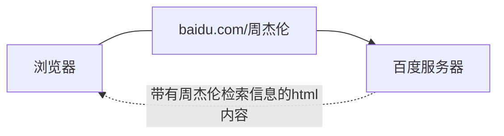
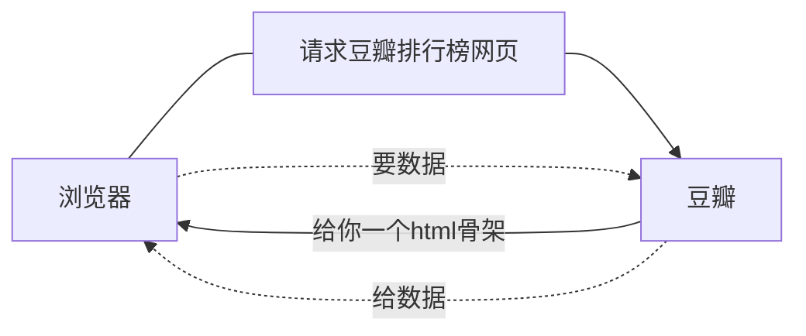
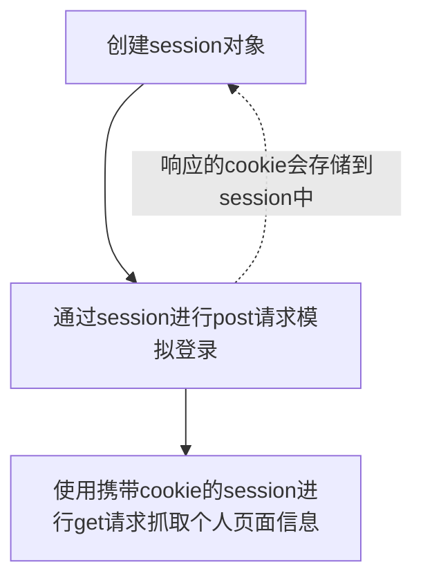

# Python Web Crawling Notes

> 参考B站视频: [Python爬虫全套课程](https://www.bilibili.com/video/BV1Yh411o7Sz?spm_id_from=333.337.search-card.all.click&vd_source=4d1339aa01c80d5f92c8bfa68d7b7c41)

## 爬虫概述

### 爬虫在使用场景中的分类

1. 通用爬虫: 抓取系统重要组成部分, 抓取的是一整张页面数据
2. 聚焦爬虫: 抓取的只是页面中特定的数据
3. 增量式爬虫: 检测网站中数据更新的情况

## 通用爬虫

### 通过`request`模块进行网络请求

- `request`模块: python中原生的一款网络请求的模块,模拟浏览器发请求
- 使用步骤:
  - 指定URL
  - 发起请求
  - 获取响应数据
  - 持久化存储

### 实战训练

#### 爬取搜狗页面

```python
import requests

if __name__ == "__main__":
    url = "https://www.sogou.com/"

    response = requests.get(url=url)

    page_text = response.text

    print(page_text)

    with open('./sougou.html', 'w', encoding='utf-8') as fp:
        fp.write(page_text)
    print("finished!")
```

#### 网页采集器

##### 反反爬策略: User-Agent伪装

门户网站的服务器会检测对应请求的载体身份标识(`UA检测`), 如果检测到的请求的载体的身份标识是`某一款浏览器`, 说明这是一次正常请求, 因此不会拒绝;

但是如果检测到请求载体身份不是任何一款浏览器时, 则表示该请求是基于爬虫的, 很可能会拒绝请求.(如下图所示)


```python
    url = 'https://www.sogou.com/web'
    
    #User-Agent Info

    headers = {
        'User-Agent': 'Mozilla/5.0 (Windows NT 10.0; Win64; x64) AppleWebKit/537.36 (KHTML, like Gecko) Chrome/104.0.5112.81 Safari/537.36 Edg/104.0.1293.54'

    }

    kw = input('enter a word: ')
    
    #parameters 
    param = {
        'query': kw
    }
    response = requests.get(url=url, params=param, headers=headers)

    page_text = response.text
    fileName = kw + '.html'
    with open(fileName, 'w', encoding='utf-8') as fp:
        fp.write(page_text)
    print('finished!')
```

#### 破解百度翻译

`post`请求: 

- 携带参数
- 响应数据是一组JSON数据

```python
import requests
import json
if __name__ == "__main__":

    post_url = "https://fanyi.baidu.com/sug"

    word = input('type in a word: ')

    data = {
        'kw': word
    }

    headers = {
        'User-Agent': 'Mozilla/5.0 (Windows NT 10.0; Win64; x64) AppleWebKit/537.36 '
                      '(KHTML, like Gecko) Chrome/104.0.5112.81 Safari/537.36 Edg/104.0.1293.54'
    }

    response = requests.post(url=post_url, data=data, headers=headers)
    # .json 方法返回的是obj(先确认响应头里的Content-Type是JSON才行)
    dic_obj = response.json()

    print(dic_obj)
    fileName = './' + word + '.json'
    fp = open(fileName, 'w', encoding='utf-8')
    json.dump(dic_obj, fp=fp, ensure_ascii=False) # 这里ensure_ascii=False是使得存储的汉字直接以汉字形式表示, 否则会是\xxxx之类的
```

#### 爬取豆瓣

> **延伸阅读**: `AJAX`
>
> 现象: 页面修改 但是网址不变

```python
import json

import requests

if __name__ == '__main__':
    url = 'https://movie.douban.com/j/chart/top_list'

    # start = input('type in the start number')

    headers = {
        'User-Agent': 'Mozilla/5.0 (Windows NT 10.0; Win64; x64) AppleWebKit/537.36 (KHTML, like Gecko) Chrome/104.0.5112.81 Safari/537.36 Edg/104.0.1293.54'
    }

    param = {
        'type': '24',
        'interval_id': '100:90',
        'action': '',
        'start': '0',
        'limit': '20',
    }

    response = requests.get(url=url, params=param, headers=headers)

    list_data = response.json()

    fp = open('./douban.json', 'w', encoding='utf-8')

    json.dump(list_data, fp=fp, ensure_ascii=False)
```

#### 爬取肯德基餐厅位置信息

```python
import requests

if __name__ == '__main__':
    url = 'http://www.kfc.com.cn/kfccda/ashx/GetStoreList.ashx'

    headers = {
        'User-Agent': 'Mozilla/5.0 (Windows NT 10.0; Win64; x64) AppleWebKit/537.36 (KHTML, like Gecko) Chrome/104.0.5112.81 Safari/537.36 Edg/104.0.1293.54'
    }

    location = input('type in the city name: ')

    data = {
        'cname': '',
        'pid': '',
        'keyword': location,
        'pageIndex': '1',
        'pageSize': '10',
    }

    param = {
        'op': 'keyword'
    }

    response = requests.post(url=url, data=data, headers=headers, params=param)

    page_text = response.text

    fileName = location + '.html'

    with open(fileName, 'w', encoding='utf-8') as fp:
        fp.write(page_text)
    print('over!')
```

> 经过摸索发现
>
> `requests.post`的`params`和`data`参数的关系: 
>
> `data`是你提供给服务器的信息
>
> `params`则是一些方式上的要求, 例如这里`'op': 'keyword'`就是以'keyword'查询, 即使我提供的`data`里可能提供了不止'keyword'的信息.

#### 综合练习之爬取药监总局

> 动态加载数据: 请求一章页面 不能得到需要的全部信息

> **总结** 
>
> 先摸清楚网站的数据库运行思路
>
> 然后顺藤摸瓜, 逐步完成爬虫

## Web请求过程剖析


1.`服务器渲染`: 在服务器端直接把数据和html整合在一起, 返回给客户端




2. `客户端渲染`:第一次请求只要一个html骨架. 第二次请求拿到数据, 进行数据展示,因此在源代码中**看不到数据**.



## HTTP协议

Hyper Text Transfer Protocol 超文本传输协议

### 请求

```
请求行 -> 请求方式(get/post) 请求URL地址 协议
请求头 -> 放一些服务器要用的附加信息

请求体 -> 一般放请求参数
```

### 响应

```
状态行 -> 协议 状态码
响应头 -> 放一些客户端要使用的一些附加信息

响应体 -> 服务器返回的真正客户端要用的内容(HTML, JSON)等
```

### 请求头中最常见的一些重要内容

1. `User-Agent` 请求载体的身份标识(用啥发送的)
2. `Referer` 防盗链(这次请求是从哪个页面来的? 反爬会用到)
3. `cookie` 本地字符串数据信息(用户登录信息, 反爬的token)

### 响应头中一些重要内容

1. `cookie` 本地字符串数据信息(用户登录信息, 反爬的token)
2. `各种神奇的莫名其妙的字符串`(一般都是token字样, 防止各种攻击和反爬)

### 请求方式

`GET` 

`POST` 

## 聚焦爬虫

### 数据解析分类

- 正则表达式
- bs4
- **xpath**(通用性强)

### 数据解析原理概述

- 解析的局部文本内容都会在标签之间或者标签对应的属性中进行存储
  - 进行指定标签的定位
  - 标签或者标签对应的属性中存储的数据值进行提取(解析)
- 编码流程:
  - 指定URL
  - 发起请求
  - 获取响应数据
  - 数据解析
  - 持久化存储

### BS4 数据解析

数据解析的原理:

- 标签定位
- 提取标签\变迁属性中存储的数据值

bs4数据解析的原理:

- 实例化一个`BeautifulSoup`对象, 并且将页面源代码数据加载到该对象中
- 通过调用`BeautifulSoup`对象中相关的属性或者方法进行标签定位和数据提取

环境安装

```terminal
pip install bs4
pip install lxml
```


#### 实例: 爬取三国演义篇目

```python
import requests
from bs4 import BeautifulSoup
if __name__ == "__main__":
    headers = {
        'User-Agent': 'Mozilla/5.0 (Windows NT 10.0; Win64; x64) AppleWebKit/537.36 (KHTML, like Gecko) Chrome/104.0.5112.81 Safari/537.36 Edg/104.0.1293.54'
    }
    url = 'https://www.shicimingju.com/book/sanguoyanyi.html'
    page_text = requests.get(url=url, headers=headers).text

    soup = BeautifulSoup(page_text, 'lxml')
    # 获取详情页和章节标题
    li_list = soup.select('.book-mulu > ul > li')
    fp = open('./sanguo.txt', 'w', encoding='utf-8')
    for li in li_list:
        title = li.a.string
        detail_url = 'http://www.shicimingju.com' + li.a['href']
        detail_page_text = requests.get(url=detail_url, headers=headers).text
        detail_soup = BeautifulSoup(detail_page_text, 'lxml')
        div_tag = detail_soup.find('div', class_='chapter_content')
        content = div_tag.text
        fp.write(title + ':' + content + '\n')
        print(title, "爬取成功")
```

### xpath解析

解析原理:

1. 实例化一个`etree`对象, 且需要将被解析的页面源码数据加载到该对象中

2. 调用`etree`对象中的`xpath`方法结合着xpath表达式实现标签的定位和内容的捕获

##### 如何实例化一个etree对象

- 本地html文档的源码数据加载到etree对象中

  ```python
  etree.parse(filePath)
  ```

- 可以将互联网上获取的源码数据加载到该对象中

  ```python
  etree.HTML('page_text')
  ```

#### xpath表达式

- `/` 表示的是从根节点开始定位, 表示的是一个层级
- `//` 表示的是多个层级, 可以表示从任意位置开始定位
- 属性定位:`//tagName[@attr='attrVal']`
- 索引定位:`//div[@class='song']/p[3]`索引是从**1**开始的
- 取文本:
  - `/text()`获取的是标签中直系的文本内容
  - `//text()`获取的是标签中所有的文本内容
- 取属性:
  - `/@attrName`

## 补充:遇到汉字编码错误的问题

- 方法一:`response.encoding='utf-8'`
- 方法二:`img_name = img_name.encode('iso-8859-1').decode('gbk')`

#### 实战: 爬取图片

```python
import os.path

import requests
from lxml import etree

headers = {
    'User-Agent': 'Mozilla/5.0 (Windows NT 10.0; Win64; x64) AppleWebKit/537.36 (KHTML, like Gecko) Chrome/104.0.5112.81 Safari/537.36 Edg/104.0.1293.54'
}

url = "http://pic.netbian.com/4kmeinv/"

response = requests.get(url=url, headers=headers)
# response.encoding = 'utf-8'
page_text = response.text
# print(page_text)

tree = etree.HTML(page_text)

li_list = tree.xpath('//div[@class="slist"]/ul[@class="clearfix"]/li')
# print(li_list)

if not os.path.exists('./picLibs'):
    os.mkdir('./picLibs')

for li in li_list:
    img_src = 'http://pic.netbian.com' + li.xpath('./a/img/@src')[0]
    img_name = li.xpath('./a/img/@alt')[0] + '.jpg'
    img_name = img_name.encode('iso-8859-1').decode('gbk')
    # print(img_name, img_src)
    img_data = requests.get(url=img_src, headers=headers).content
    img_path = "./picLibs/" + img_name
    with open(img_path, 'wb') as fp:
        fp.write(img_data)
        print(img_name, "success!")
```

> 一次查询多个`xpath` 路径:
>
> `a_list = tree.xpath('//div[@class="bottom"]/ul/li/a | //div[@class="bottom"]/ul/div[2]/li/a')`

#### 作业: 爬取站长素材中的免费简历模板

```python
import requests
from lxml import etree
import os.path

'''
流程分析:
1.  爬取主页, 解析出所有模板子页的URL
2. 爬取子页, 解析出其中的下载url
3. 对下载URL发请求, 保存下载的结果
'''

headers = {
    'User-Agent': 'Mozilla/5.0 (Windows NT 10.0; Win64; x64) AppleWebKit/537.36 (KHTML, like Gecko) Chrome/104.0.5112.81 Safari/537.36 Edg/104.0.1293.54'
}

url_main = "https://sc.chinaz.com/jianli/free.html"

page_text = requests.get(url=url_main, headers=headers).text
# print(page_text)
tree = etree.HTML(page_text)

div_list = tree.xpath('/html/body/div[4]/div[3]/div/div/div')
# print(div_list)

if not os.path.exists('./download'):
    os.mkdir('./download')
cnt = 0
for div in div_list:
    cnt += 1
    src = 'https:' + div.xpath('./a/@href')[0]
    # name = div.xpath('./a/img/@alt')[0]
    # print(name)
    print(src)
    targetPageText = requests.get(url=src, headers=headers).text
    # with open('./test.html', 'w', encoding='utf-8') as fp:
    #     fp.write(targetPageText)
    # # print(targetPageText)
    tree_2 = etree.HTML(targetPageText)
    targetSrc = tree_2.xpath('/html/body/div[4]/div[2]/div[2]/div[1]/div[7]/div[2]/ul/li[1]/a/@href')[0]
    print(targetSrc)
    # targetName = tree_2.xpath('/html/body/div[6]/div[2]/div[2]/div[1]/div[1]/h1/text()')
    # print(targetName, targetSrc)
    targetData = requests.get(url=targetSrc, headers=headers).content
    filePath = './download/' + str(cnt) + '.rar'
    with open(filePath, 'wb') as fp:
        fp.write(targetData)

```


### 验证码

反爬机制: 验证码. 识别验证码图片中的数据, 用于模拟登录操作.

识别验证码的操作:

- 人工肉眼识别(不推荐)
- 第三方自动识别

### 模拟登录

- 爬取基于某些用户的用户信息, 但是需要登录才能获取

`http/https` 协议特性: 无状态

没有请求到对应页面数据的原因:

​	发起的第二次请求是基于个人主页页面请求的时候, 服务器端并不知道该次请求是基于登录状态下的请求.

#### cookie

用来让服务器端记录客户端的状态

##### 手动cookie处理

```python
headers = {
    'Cookie': 'xxxx'
    'User-Agent': 'xxx'
}
```

> 问题:
>
> 1. 部分网站的`cookie`存在有效时长限制, 不能持久化
> 2. 需要手动复制, 比较麻烦

##### 自动处理

- `cookie`值的来源是哪里?

  模拟登录`post`请求之后, 有服务器端创建

- `session`会话对象

  - 可以用于请求的发送
  - 如果请求过程中产生了cookie, 则该cookie会被自动存储/携带在该session对象中, 

- 使用session对象进行模拟登录post请求的发送(响应的cookie会存储在session中)

- session对象对个人主页对应的get请求进行发送



### 代理

> 报错:请求次数过多->拒绝该次请求, 封禁该IP的请求

反反爬机制: 破解封IP这种反爬机制

#### 什么是代理

`代理服务器`.

作用: 

- 突破自身IP访问的限制
- 隐藏自身真实IP免受攻击

### 相关网站

- 快代理
- 西祠代理
- www.goubanjia.com

#### 代理IP的类型

- http: 应用到http协议对应的url中
- https: 应用到https协议对应的url中

#### 代理IP的匿名度

- 透明: 服务器知道该次请求使用了代理, 也知道请求对应的真实IP
- 匿名: 知道使用了代理, 不知道真实IP
- 高匿: 不知道使用了代理, 更不知道真实IP

## 高性能异步爬虫<sup>鸽</sup>

目的: 在爬虫中使用异步实现高性能的数据爬取操作

对比单线程串行: 部分方法阻塞程序

多线程,多进程: 好处, 可以为相关阻塞的操作单独开启线程或者进程, 阻塞操作就可以异步执行.


线程池\进程池

## selenium

> 问题: selenium和爬虫有什么关系?

作用:

- 便捷的获取网站中`动态加载`的数据
- 便捷实现`模拟登录`

### selenium介绍

基于浏览器自动化的一个模块

流程:

1. `pip install selenium`

2. 下载一个浏览器的驱动程序(edge为例)

   > [Microsoft Edge WebDriver - Microsoft Edge Developer](https://developer.microsoft.com/en-us/microsoft-edge/tools/webdriver/)
   >
   > **注意**: 需要下载适配浏览器版本的版本

3. 将压缩文件中的`msedgedriver.exe `放到python解释器所在的文件夹中, 并确保该文件夹路径已经添加到`环境变量`中

4. ```python
   '''
   测试
   '''
   from selenium.webdriver import Edge
   #1.创建浏览器对象
   web = Edge()
   #2.打开网址
   web.get('http://www.baidu.com')
   ```

### find_element()

```python 
class By:
    """
    Set of supported locator strategies.
    """

    ID = "id"
    XPATH = "xpath"
    LINK_TEXT = "link text"
    PARTIAL_LINK_TEXT = "partial link text"
    NAME = "name"
    TAG_NAME = "tag name"
    CLASS_NAME = "class name"
    CSS_SELECTOR = "css selector"
```

### 处理iframe+动作链

#### 规避检测风险

```python
from selenium import webdriver
from selenium.webdriver import ActionChains
from selenium.webdriver import EdgeOptions
import time


option = EdgeOptions()

option.add_experimental_option('excludeSwitches', ['enable-automation'])

bro = webdriver.Edge(options=option)
```

